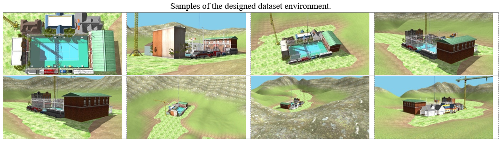
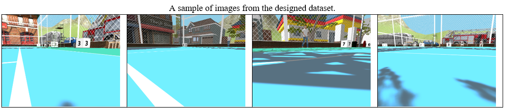
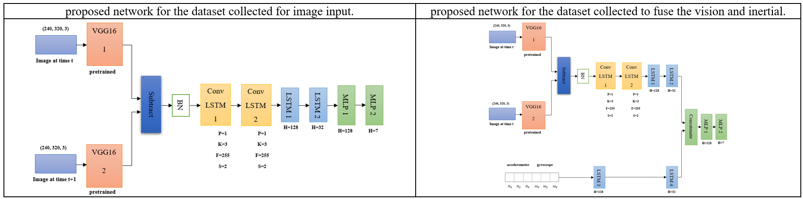

# 🚀 Deep Visual-Inertial Odometry using Gazebo Simulation

A deep learning-based framework for visual-inertial odometry (VIO) using a custom dataset generated in Gazebo. This project integrates monocular images and IMU data with a CNN-RNN architecture to estimate robot trajectory with improved accuracy.

## 🧠 Overview

Visual-Inertial Odometry (VIO) plays a critical role in autonomous navigation. Traditional methods often struggle in dynamic environments and require careful manual tuning.

In this project, we propose a learning-based VIO system that:

- Uses a custom dataset generated in Gazebo
- Extracts spatial features using a VGG16-based CNN
- Learns temporal dependencies using LSTM / ConvLSTM
- Fuses image and IMU data
- Achieves significant improvement in trajectory estimation accuracy

<table align="center">
  <tr>
    <td></td>
  </tr>
</table>
 

📉 **Result**: Mean Squared Error (MSE) improved from **4.99 → 0.63**

## 🗂 Dataset (Gazebo Simulation)

A custom dataset was created using the Gazebo simulator to ensure:

- Controlled environment
- High similarity between training and testing data
- Flexible sensor integration

### 🔧 Sensors Used
- Monocular Camera
- IMU (Accelerometer + Gyroscope)

### 📦 Dataset Includes
- Image sequences
- IMU measurements
- Ground truth trajectories

<table align="center">
  <tr>
    <td></td>
  </tr>
  <tr>
    <td></td>
  </tr>
</table>
 

## 🏗 Methodology

The proposed architecture combines spatial and temporal learning:

<table align="center">
  <tr>
    <td></td>
  </tr>
</table>

### 🔹 Feature Extraction
- Pretrained VGG16 used to extract visual features from consecutive frames
### 🔹 Motion Representation
- Features from two frames are combined to capture motion dynamics
### 🔹 Temporal Modeling
- ConvLSTM + LSTM layers learn temporal dependencies
### 🔹 Output
- 7-dimensional vector:
- 3D position (x, y, z)
- 4D orientation (quaternion)

## 📊 Results

The proposed method was evaluated against baseline approaches such as VINet.
